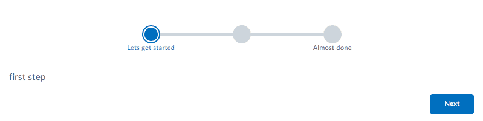

# Wizard

[](https://www.npmjs.org/package/@brightspace-ui-labs/wizard)

> Note: this is a ["labs" component](https://github.com/BrightspaceUI/guide/wiki/Component-Tiers). While functional, these tasks are prerequisites to promotion to BrightspaceUI "official" status:
>
> - [x] [Design organization buy-in](https://github.com/BrightspaceUI/guide/wiki/Before-you-build#working-with-design)
> - [x] [design.d2l entry](http://design.d2l/)
> - [ ] [Architectural sign-off](https://github.com/BrightspaceUI/guide/wiki/Before-you-build#web-component-architecture)
> - [x] [Continuous integration](https://github.com/BrightspaceUI/guide/wiki/Testing#testing-continuously-with-travis-ci)
> - [x] [Cross-browser testing](https://github.com/BrightspaceUI/guide/wiki/Testing#cross-browser-testing-with-sauce-labs)
> - [x] [Unit tests](https://github.com/BrightspaceUI/guide/wiki/Testing#testing-with-polymer-test) (if applicable)
> - [ ] [Accessibility tests](https://github.com/BrightspaceUI/guide/wiki/Testing#automated-accessibility-testing-with-axe)
> - [ ] [Visual diff tests](https://github.com/BrightspaceUI/visual-diff)
> - [x] [Localization](https://github.com/BrightspaceUI/guide/wiki/Localization) with Serge (if applicable)
> - [x] Demo page
> - [X] README documentation

For further information on this and other components, refer to [The Brightspace UI Guide](https://github.com/BrightspaceUI/guide/wiki).

## Installation

To install from NPM:

```shell
npm install @brightspace-ui-labs/wizard
```

## Usage

Include the [webcomponents.js](http://webcomponents.org/polyfills/) polyfill loader (for browsers who don't natively support web components), then include necessary components:



```html
<head>
  <script type="module" src="@brightspace-ui-labs/wizard/d2l-wizard.js"></script>
  <script type="module" src="@brightspace-ui-labs/wizard/d2l-step.js"></script>
</head>
```

### Basic Usage

Add the component to your page

```html
<d2l-labs-wizard id="wizard">
	<d2l-labs-step title="Step 1">
		<p> First step </p>
	</d2l-labs-step>

	<d2l-labs-step title="Step 2">
		<p> Second step </p>
	</d2l-labs-step>
</d2l-labs-wizard>
<script>
	var wizard = document.getElementById('wizard');
	wizard.addEventListener('stepper-next', function() {
		wizard.next();
	});
	wizard.addEventListener('stepper-restart', function() {
		wizard.restart();
	});
</script>
```


**Properties:**

| Properties | Type | Description |
|--|--|--|
| `title` | String | Text displayed in the wizard step |
| `restart-button-title` | String | Text that is displayed within the button |
| `restart-button-tooltip` | String | Text that is displayed within the button tooltip |
| `hide-restart-button` | Boolean | Hide the Restart button |
| `next-button-title` | String | Text that is displayed within the button |
| `next-button-tooltip` | String | Text that is displayed within the button tooltip |
| `disable-next-button` | Boolean | Disable the Next button |
| `hide-next-button` | Boolean | Hide the Next button |

**Events:**
- `stepper-next`: dispatched when the Next button is clicked
- `stepper-restart`: dispatched when the Restart button is clicked

## Developing, Testing and Contributing

After cloning the repo, run `npm install` to install dependencies.

To run the app and view the demo page:

```shell
npm run start
```

To lint ([eslint](http://eslint.org/) and [Polymer lint](https://www.polymer-project.org/2.0/docs/tools/polymer-cli-commands#lint)):

```shell
npm run lint
```

To lint AND run local unit tests:

```shell
npm run test
```

## Versioning & Releasing

> TL;DR: Commits prefixed with `fix:` and `feat:` will trigger patch and minor releases when merged to `master`. Read on for more details...

The [sematic-release GitHub Action](https://github.com/BrightspaceUI/actions/tree/master/semantic-release) is called from the `release.yml` GitHub Action workflow to handle version changes and releasing.

### Version Changes

All version changes should obey [semantic versioning](https://semver.org/) rules:
1. **MAJOR** version when you make incompatible API changes,
2. **MINOR** version when you add functionality in a backwards compatible manner, and
3. **PATCH** version when you make backwards compatible bug fixes.

The next version number will be determined from the commit messages since the previous release. Our semantic-release configuration uses the [Angular convention](https://github.com/conventional-changelog/conventional-changelog/tree/master/packages/conventional-changelog-angular) when analyzing commits:
* Commits which are prefixed with `fix:` or `perf:` will trigger a `patch` release. Example: `fix: validate input before using`
* Commits which are prefixed with `feat:` will trigger a `minor` release. Example: `feat: add toggle() method`
* To trigger a MAJOR release, include `BREAKING CHANGE:` with a space or two newlines in the footer of the commit message
* Other suggested prefixes which will **NOT** trigger a release: `build:`, `ci:`, `docs:`, `style:`, `refactor:` and `test:`. Example: `docs: adding README for new component`

To revert a change, add the `revert:` prefix to the original commit message. This will cause the reverted change to be omitted from the release notes. Example: `revert: fix: validate input before using`.

### Releases

When a release is triggered, it will:
* Update the version in `package.json`
* Tag the commit
* Create a GitHub release (including release notes)
* Deploy a new package to NPM

### Releasing from Maintenance Branches

Occasionally you'll want to backport a feature or bug fix to an older release. `semantic-release` refers to these as [maintenance branches](https://semantic-release.gitbook.io/semantic-release/usage/workflow-configuration#maintenance-branches).

Maintenance branch names should be of the form: `+([0-9])?(.{+([0-9]),x}).x`.

Regular expressions are complicated, but this essentially means branch names should look like:
* `1.15.x` for patch releases on top of the `1.15` release (after version `1.16` exists)
* `2.x` for feature releases on top of the `2` release (after version `3` exists)
